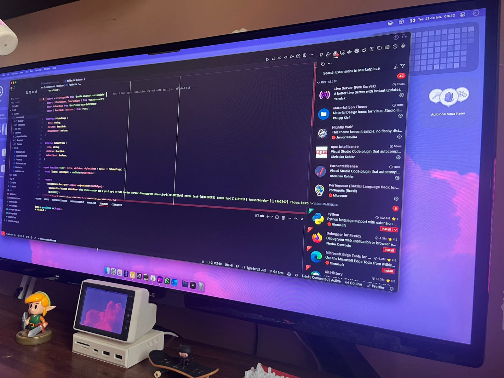
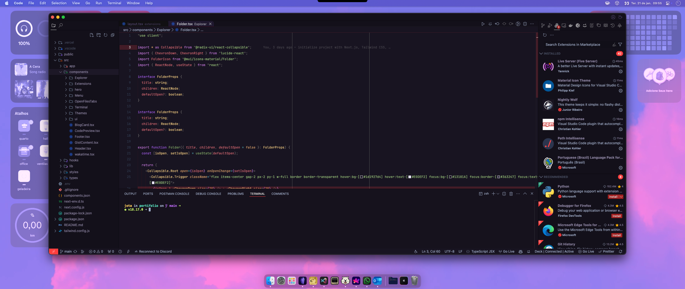
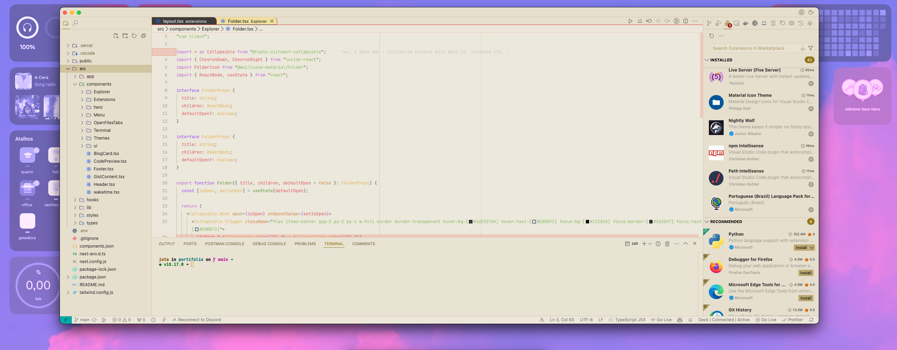
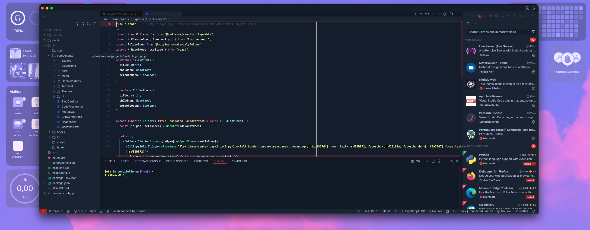

# Nightly Wolf Theme 🐺

A minimalistic VSCode theme **built for dev BY dev**, developed with ☕ 🖤.

---

## Description

**Nightly Wolf Theme** offers a refined and distraction-free coding experience. Designed with a focus on simplicity, it avoids flashy visuals and harsh colors, providing eye-friendly syntax and semantic highlighting tailored for popular programming languages. Perfect for those late-night coding marathons or all-day sprints, this theme ensures your comfort and focus remain undisturbed.

---

## Preview

### Dark Theme (Default)




### Light Theme



### Dark Theme (Soft Mode)



---

## Installation 🚀

1. Open the Extensions sidebar in Visual Studio Code.
2. Search for **Nightly Wolf Theme** or **jotacode**.
3. Click **Install**.
4. Reload your editor for the changes to take effect.
5. Go to **Manage** (bottom left corner) > **Color Theme** > **Nightly Wolf Theme**.
6. Don’t forget to leave a ⭐⭐⭐⭐⭐ review to support our work! 🐺😄

---

## Features

- **Clean and Minimalistic Design**: Focus entirely on your code without unnecessary distractions.
- **Ergonomic Colors**: Say goodbye to eye strain with carefully selected hues.
- **Enhanced Syntax Highlighting**: Precision-tuned for popular programming languages.
- **Multiple Modes**: Choose between default dark, soft dark, or light mode.

---

## Recommended Settings

```json
{
  "editor.fontFamily": "JetBrains Mono, 'Courier New', monospace",
  "editor.fontSize": 12,
  "editor.fontWeight": "300",
  "editor.lineHeight": 20,
  "editor.letterSpacing": 0.5,
  "editor.fontLigatures": true
}
```

### Custom VSCode Settings

If you want, you can access my VSCode settings at [this Gist](https://gist.github.com/codejota/44a29319aa43ce2a06bc146aafd300b5). These settings are compatible with the [VSCode Custom CSS Extension](https://marketplace.visualstudio.com/items?itemName=be5invis.vscode-custom-css).

---

## Feedback

Your feedback is invaluable! If you encounter any issues or have suggestions, please open an [issue](https://github.com/codejota/nightly-wolf/issues) on our GitHub repository.

---

## Contributing

We welcome contributions! Follow these steps:

1. Fork the repository.
2. Create a new branch for your feature (`git checkout -b feature/feature`).
3. Commit your changes (`git commit -m 'Add some feature'`).
4. Push to your branch (`git push origin feature/feature`).
5. Open a Pull Request for review.

---

## License

This project is licensed under the MIT License. For more details, check the `LICENSE` file.

---

## Inspirations

- **HackerTheBox**

Thank you for using **Nightly Wolf Theme**. Happy coding! 🚀🐺
